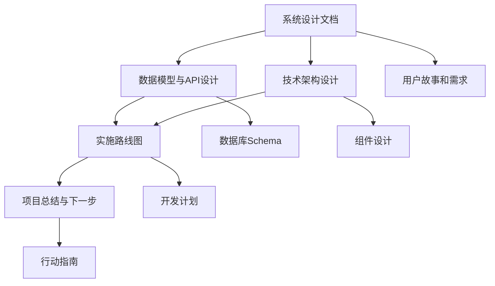

# 📚 AgentX Agentic RAG 系统设计文档

## 🎯 项目概述

基于 AgentX 框架和 PromptX 集成的智能助手系统，让用户能够创建专业的 AI 助手，通过上传文档让助手学习专业知识，并提供智能问答服务。

### 核心特性
- 🤖 **智能助手**：创建专业领域的 AI 助手
- 📄 **文档学习**：上传文档，助手自动学习专业知识
- 💬 **智能对话**：基于文档内容的专业问答
- 🧠 **持续学习**：记住用户偏好，越用越懂你
- ⚡ **实时响应**：流式对话，即时反馈

---

## 📋 文档导航

### 🏗️ 设计文档

| 文档 | 描述 | 适合人群 |
|------|------|----------|
| **[系统设计文档](./agentic-rag-system-design.md)** | 项目概述、用户故事、系统架构 | 产品经理、架构师 |
| **[数据模型与API设计](./data-model-and-api-design.md)** | 数据库设计、API规范、事件系统 | 后端开发者 |
| **[技术架构设计](./technical-architecture.md)** | 分层架构、组件设计、集成方案 | 技术负责人、架构师 |
| **[实施路线图](./implementation-roadmap.md)** | 开发计划、技术选型、质量保证 | 项目经理、开发团队 |
| **[项目总结与下一步](./project-summary-and-next-steps.md)** | 分析总结、交付成果、行动指南 | 所有角色 |

### 📊 文档关系图

---

## 🚀 快速开始

### 1. 理解项目背景

**从这里开始** → [系统设计文档](./agentic-rag-system-design.md)

了解：
- 项目的核心理念和用户价值
- 5个核心用户故事
- 系统架构概览
- MVP功能范围

### 2. 深入技术细节

**技术人员必读** → [技术架构设计](./technical-architecture.md)

掌握：
- 分层架构设计
- AgentX 和 PromptX 集成方案
- 核心组件实现
- 性能优化策略

### 3. 了解数据设计

**开发前必看** → [数据模型与API设计](./data-model-and-api-design.md)

学习：
- 完整的数据库Schema
- REST API 接口规范
- 事件系统设计
- 错误处理机制

### 4. 制定开发计划

**项目管理参考** → [实施路线图](./implementation-roadmap.md)

获得：
- 4阶段开发计划
- 技术选型建议
- 测试策略
- 部署方案

### 5. 开始实施

**立即行动** → [项目总结与下一步](./project-summary-and-next-steps.md)

执行：
- 环境准备步骤
- 技术验证重点
- 风险控制建议
- 成功标准定义

---

## 🎯 角色导航

### 👨‍💼 产品经理
**推荐阅读顺序**：
1. [系统设计文档](./agentic-rag-system-design.md) - 了解产品概念和用户价值
2. [实施路线图](./implementation-roadmap.md) - 掌握开发计划和里程碑
3. [项目总结与下一步](./project-summary-and-next-steps.md) - 了解项目现状和下一步

**关注重点**：
- 用户故事和核心功能
- MVP范围定义
- 开发时间规划
- 成功指标设定

### 👨‍💻 技术负责人/架构师
**推荐阅读顺序**：
1. [技术架构设计](./technical-architecture.md) - 掌握整体技术架构
2. [数据模型与API设计](./data-model-and-api-design.md) - 了解数据设计
3. [实施路线图](./implementation-roadmap.md) - 制定技术实施计划
4. [项目总结与下一步](./project-summary-and-next-steps.md) - 技术验证和风险控制

**关注重点**：
- 分层架构设计
- 技术选型决策
- 性能优化策略
- 安全架构设计

### 👨‍💻 后端开发者
**推荐阅读顺序**：
1. [数据模型与API设计](./data-model-and-api-design.md) - 数据库和API设计
2. [技术架构设计](./technical-architecture.md) - 后端组件设计
3. [实施路线图](./implementation-roadmap.md) - 开发任务和时间安排

**关注重点**：
- 数据库Schema设计
- REST API规范
- AgentX/PromptX集成
- 事件系统实现

### 👨‍💻 前端开发者
**推荐阅读顺序**：
1. [系统设计文档](./agentic-rag-system-design.md) - 了解用户界面需求
2. [数据模型与API设计](./data-model-and-api-design.md) - API接口规范
3. [技术架构设计](./technical-architecture.md) - 前端架构设计

**关注重点**：
- 用户界面设计
- API接口调用
- WebSocket实时通信
- 状态管理策略

### 👨‍💼 项目经理
**推荐阅读顺序**：
1. [实施路线图](./implementation-roadmap.md) - 项目计划和管理
2. [系统设计文档](./agentic-rag-system-design.md) - 项目范围和目标
3. [项目总结与下一步](./project-summary-and-next-steps.md) - 风险管理和成功标准

**关注重点**：
- 开发阶段规划
- 资源需求评估
- 风险识别和控制
- 质量保证策略

---

## 📊 项目统计

### 文档概览
- **总文档数**：5个核心设计文档
- **总页数**：约50页详细设计
- **涵盖范围**：从概念设计到实施细节
- **更新状态**：2024年12月最新版本

### 技术栈
- **后端**：AgentX + PromptX + Fastify + Prisma + Qdrant
- **前端**：React + TypeScript + Vite + TanStack Query
- **数据库**：PostgreSQL + Redis + Qdrant
- **部署**：Docker + Docker Compose

### 开发规模
- **预计开发时间**：10-13周
- **团队规模建议**：3-5人
- **代码复用率**：60%（来自现有项目）
- **MVP功能**：6个核心功能模块

---

## 🔗 相关资源

### 技术文档
- [AgentX Framework 文档](../packages/agent/README.md)
- [PromptX 集成指南](../promptx-agenticRag/README.md)
- [Qdrant 向量数据库文档](https://qdrant.tech/documentation/)

### 开发工具
- [TypeScript 官方文档](https://www.typescriptlang.org/docs/)
- [React 官方文档](https://react.dev/)
- [Fastify 框架文档](https://www.fastify.io/docs/)

### 设计参考
- [AnythingLLM 项目](https://github.com/Mintplex-Labs/anything-llm)
- [LangChain 架构设计](https://docs.langchain.com/docs/)
- [Vercel AI SDK](https://sdk.vercel.ai/docs)

---

## 📞 支持和反馈

### 问题反馈
如果在阅读文档或实施过程中遇到问题，请：
1. 首先查看 [项目总结与下一步](./project-summary-and-next-steps.md) 中的常见问题
2. 检查相关技术文档和最佳实践
3. 记录问题和解决方案，完善项目文档

### 文档更新
随着项目的推进，请及时更新相关文档：
- 设计变更时更新架构文档
- 新增功能时更新API文档
- 遇到问题时更新实施指南
- 项目完成时更新总结文档

### 版本管理
- **当前版本**：v1.0 (设计阶段)
- **下一版本**：v1.1 (实施阶段)
- **更新频率**：根据项目进展及时更新
- **版本说明**：每次更新请记录变更内容

---

## 🎉 开始你的 Agentic RAG 之旅

现在你已经掌握了完整的项目设计，可以开始构建这个创新的智能助手系统了！

**建议的第一步**：
1. 📖 阅读 [系统设计文档](./agentic-rag-system-design.md) 了解项目全貌
2. 🔧 按照 [项目总结与下一步](./project-summary-and-next-steps.md) 准备开发环境
3. 💻 开始第一阶段的基础架构开发

祝你开发顺利！🚀