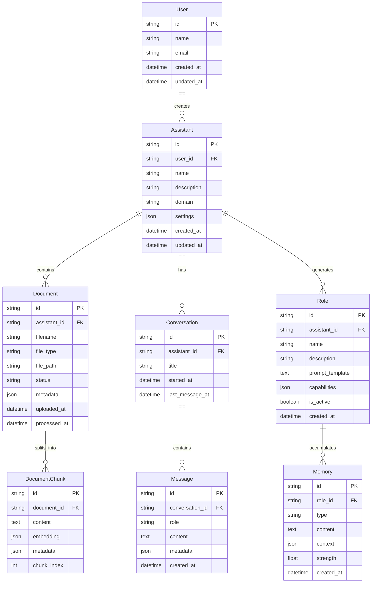
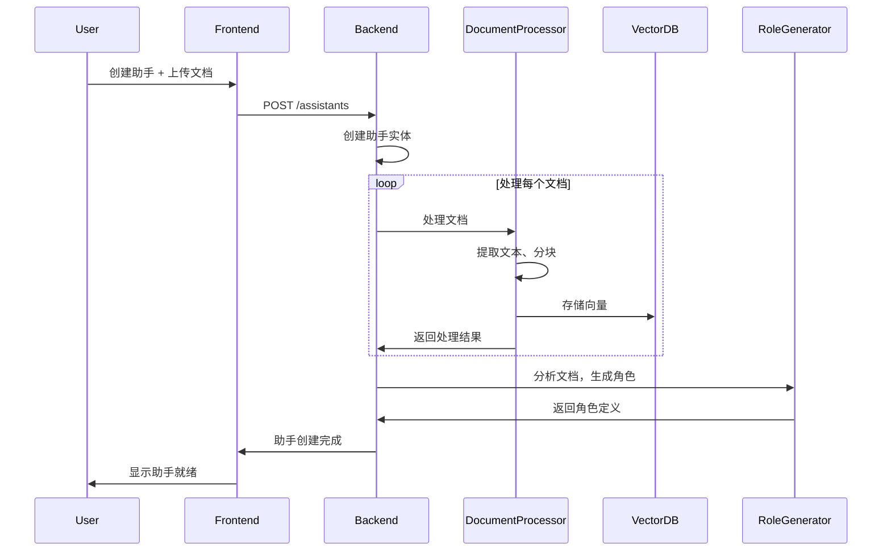
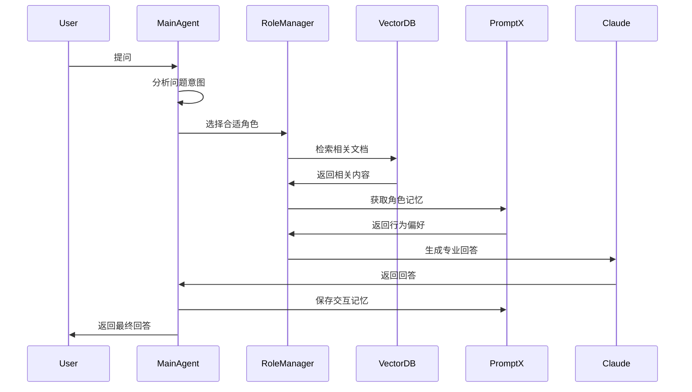

# 🤖 AgentX Agentic RAG 系统设计文档

## 📋 项目概述

基于 AgentX 框架构建的智能助手系统，让用户能够创建专业的 AI 助手，通过上传文档让助手学习专业知识，并提供智能问答服务。

### 核心理念
- **简单易用**：用户只需要创建"助手"，不需要理解复杂的技术概念
- **专业智能**：助手能够基于上传的文档提供专业、有依据的回答
- **持续学习**：助手会记住用户偏好，越用越懂用户需求

---

## 🎯 核心用户故事

### 1. 创建助手
- 用户创建一个新助手（如"法律助手"、"财务助手"）
- 上传相关专业文档（PDF、Word、Excel等）
- 系统自动处理文档，建立知识库
- 助手获得专业知识，可以开始服务

### 2. 智能问答
- 用户向助手提问
- 助手理解问题，检索相关知识
- 结合专业角色和文档内容，提供专业回答
- 支持多轮对话，保持上下文

### 3. 持续学习
- 助手在对话中学习用户偏好
- 记住用户的提问习惯和回答偏好
- 下次类似问题时提供更个性化的服务

### 4. 文档管理
- 查看助手已学习的文档列表
- 上传新文档扩展知识库
- 删除过时或错误的文档
- 查看文档处理状态

### 5. 助手设置
- 调整助手的专业方向
- 设置回答风格（详细/简洁、正式/友好）
- 查看助手的能力和专长
- 管理助手的行为偏好

---

## 🏗️ 系统架构

### 用户视角 vs 技术实现

**用户看到的**：
```
用户 ←→ 助手 (简单对话界面)
```

**技术实现**：
```
用户 ←→ 主协调者 ←→ 专业角色群 ←→ 知识库
                ↓
            PromptX记忆系统
```

### 核心组件

#### 1. 助手实体 (Assistant Entity)
- **主协调者**：理解用户意图，调度专业角色
- **专业角色群**：根据文档内容自动生成的专业角色
- **知识库**：基于上传文档的向量数据库
- **记忆系统**：基于 PromptX 的行为记忆

#### 2. 技术栈
- **AgentX**：事件驱动框架、状态管理、Agent 生命周期
- **PromptX**：角色定义、记忆管理、MCP 协议
- **Claude**：底层 LLM、多角色协作能力
- **Qdrant**：向量数据库、文档检索

---

## 📊 数据模型设计

### 核心实体关系



### 实体详细说明

#### Assistant (助手)
```typescript
interface Assistant {
  id: string;
  userId: string;
  name: string;                    // "法律助手"
  description: string;             // "专业的法律文档分析助手"
  domain: string;                  // "legal", "finance", "tech"
  settings: {
    responseStyle: 'detailed' | 'concise';
    tone: 'formal' | 'friendly';
    language: string;
    maxTokens: number;
  };
  createdAt: Date;
  updatedAt: Date;
}
```

#### Document (文档)
```typescript
interface Document {
  id: string;
  assistantId: string;
  filename: string;
  fileType: string;               // "pdf", "docx", "txt"
  filePath: string;
  status: 'uploading' | 'processing' | 'completed' | 'failed';
  metadata: {
    size: number;
    pageCount?: number;
    language?: string;
    extractedText?: string;
  };
  uploadedAt: Date;
  processedAt?: Date;
}
```

#### Role (角色)
```typescript
interface Role {
  id: string;
  assistantId: string;
  name: string;                   // "合同风险分析师"
  description: string;            // "专门分析合同中的法律风险"
  promptTemplate: string;         // 角色的提示词模板
  capabilities: string[];         // ["风险识别", "条款分析"]
  isActive: boolean;
  createdAt: Date;
}
```

#### Memory (记忆)
```typescript
interface Memory {
  id: string;
  roleId: string;
  type: 'preference' | 'habit' | 'insight';
  content: string;                // "用户偏好详细的风险分析"
  context: {
    conversationId?: string;
    messageId?: string;
    keywords: string[];
  };
  strength: number;               // 0-1, 记忆强度
  createdAt: Date;
}
```

---

## 🔄 核心工作流

### 1. 助手创建流程



### 2. 智能问答流程



---

## 🛠️ 技术实现要点

### AgentX 集成
- 每个助手对应一个 AgentX Agent 实例
- 使用 SystemBus 管理事件流
- MealyMachine 处理状态转换
- 支持流式响应和实时更新

### PromptX 集成
- 通过 MCP 协议集成 PromptX
- 角色定义存储在 PromptX 角色库
- 使用 remember/recall 管理行为记忆
- 支持角色动态切换

### 向量数据库
- 每个助手有独立的命名空间
- 支持多种文档格式处理
- 智能分块和嵌入策略
- 高效的相似度检索

### 前端架构
- React + TypeScript
- 实时事件流显示
- 文件上传和进度管理
- 对话界面和历史管理

---

## 📈 MVP 功能范围

### 包含功能
- ✅ 单用户系统
- ✅ 助手创建和管理
- ✅ 文档上传和处理
- ✅ 基础问答功能
- ✅ 简单的角色调度
- ✅ 行为记忆积累
- ✅ Web 界面

### 暂不包含
- ❌ 多租户和权限管理
- ❌ 文档版本控制
- ❌ 复杂的多角色协作
- ❌ 角色自动生成（手动配置）
- ❌ 高级分析和报告

---

## 🎯 下一步计划

1. **详细设计阶段**
   - API 接口设计
   - 数据库 Schema 设计
   - 组件架构设计

2. **原型开发阶段**
   - 核心后端 API
   - 基础前端界面
   - 文档处理流水线

3. **集成测试阶段**
   - AgentX 集成测试
   - PromptX 集成测试
   - 端到端功能测试

这个设计文档为后续的详细开发提供了清晰的指导方向。