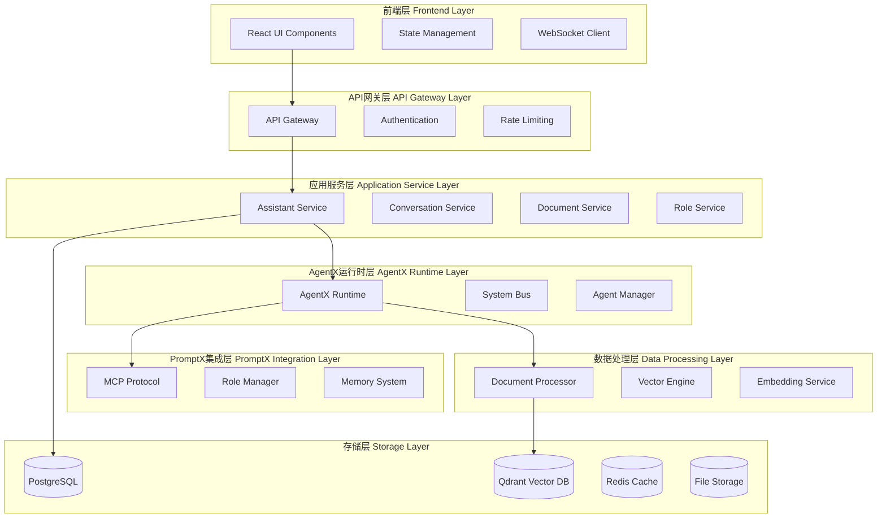
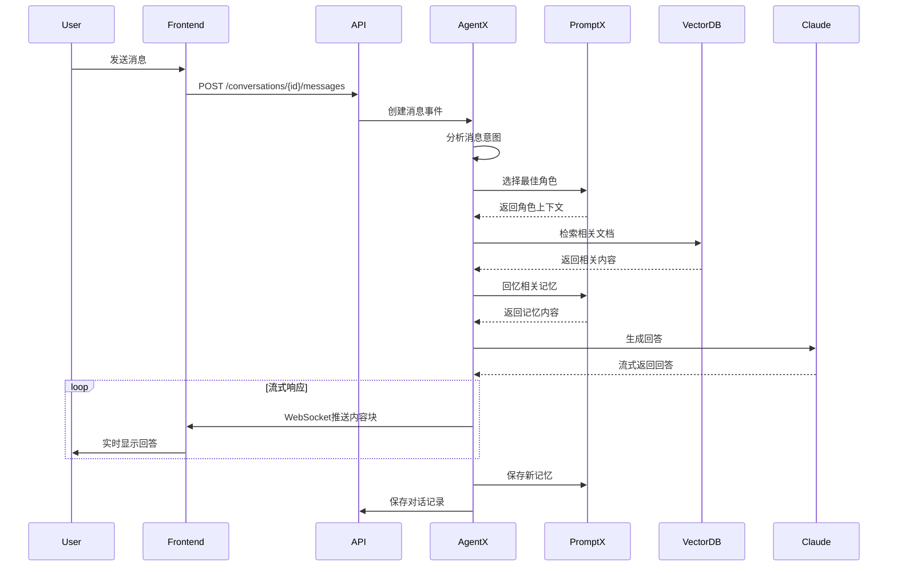
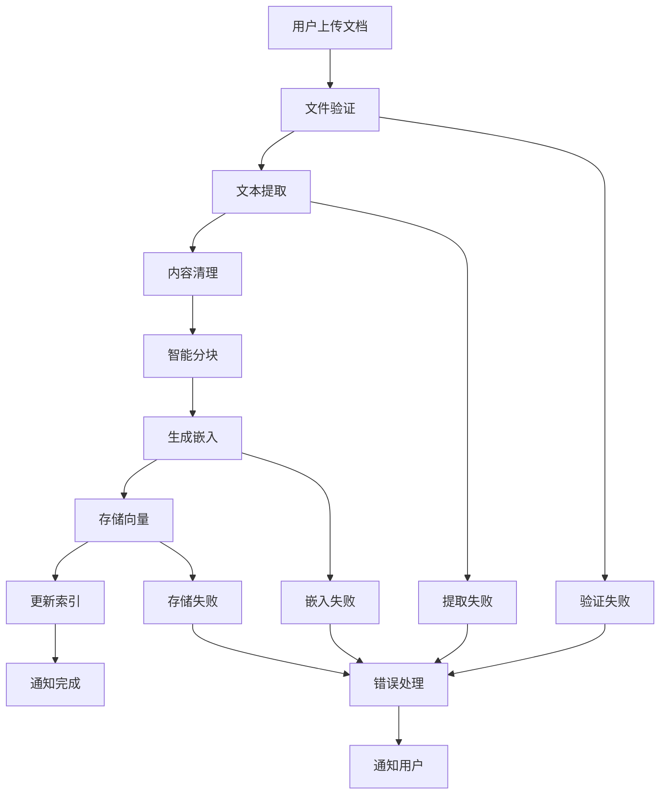

# 🏗️ 技术架构设计

## 📋 整体架构概览

### 系统分层架构



---

## 🔧 核心组件设计

### 1. AgentX 集成架构

#### Agent 生命周期管理
```typescript
interface AssistantAgent {
  id: string;
  config: AgentConfig;
  runtime: AgentXRuntime;
  roles: Map<string, Role>;
  memory: MemorySystem;
  
  // 生命周期方法
  initialize(): Promise<void>;
  activate(): Promise<void>;
  deactivate(): Promise<void>;
  destroy(): Promise<void>;
  
  // 核心功能
  processMessage(message: UserMessage): AsyncIterable<AgentResponse>;
  switchRole(roleId: string): Promise<void>;
  updateMemory(memory: Memory): Promise<void>;
}
```

#### 事件驱动架构
```typescript
// AgentX 事件类型
interface AgentXEvents {
  // 消息事件
  'message.received': { messageId: string; content: string };
  'message.processing': { messageId: string; progress: number };
  'message.completed': { messageId: string; response: string };
  
  // 角色事件
  'role.activated': { roleId: string; roleName: string };
  'role.switched': { fromRole: string; toRole: string };
  
  // 文档事件
  'document.processing': { documentId: string; status: string };
  'document.indexed': { documentId: string; chunks: number };
  
  // 记忆事件
  'memory.created': { memoryId: string; type: string };
  'memory.recalled': { query: string; results: Memory[] };
}

// 事件处理器
class AgentEventHandler extends BaseEventHandler {
  async handleMessageReceived(event: AgentXEvents['message.received']) {
    // 处理用户消息
    const agent = await this.getAgent(event.agentId);
    const response = agent.processMessage(event.content);
    
    // 发布处理进度事件
    this.systemBus.publish('message.processing', {
      messageId: event.messageId,
      progress: 0
    });
  }
  
  async handleRoleSwitch(event: AgentXEvents['role.switched']) {
    // 处理角色切换
    const agent = await this.getAgent(event.agentId);
    await agent.switchRole(event.toRole);
    
    // 更新前端状态
    this.websocketService.broadcast('role.changed', event);
  }
}
```

### 2. PromptX 集成设计

#### MCP 协议集成
```typescript
interface PromptXIntegration {
  // 角色管理
  activateRole(roleId: string): Promise<RoleContext>;
  deactivateRole(roleId: string): Promise<void>;
  
  // 记忆管理
  remember(content: string, context: MemoryContext): Promise<void>;
  recall(query: string, mode: RecallMode): Promise<Memory[]>;
  
  // 工具调用
  callTool(toolName: string, parameters: any): Promise<ToolResult>;
}

class PromptXService implements PromptXIntegration {
  private mcpClient: MCPClient;
  
  async activateRole(roleId: string): Promise<RoleContext> {
    const result = await this.mcpClient.call('promptx_action', {
      role: roleId
    });
    
    return {
      roleId,
      capabilities: result.capabilities,
      memoryNetwork: result.memoryNetwork,
      promptTemplate: result.promptTemplate
    };
  }
  
  async recall(query: string, mode: RecallMode = 'balanced'): Promise<Memory[]> {
    const result = await this.mcpClient.call('promptx_recall', {
      role: this.currentRole,
      query,
      mode
    });
    
    return result.memories.map(m => ({
      id: m.id,
      content: m.content,
      strength: m.strength,
      context: m.context
    }));
  }
}
```

#### 角色动态切换机制
```typescript
class RoleOrchestrator {
  private activeRoles: Map<string, RoleContext> = new Map();
  private roleSelectionStrategy: RoleSelectionStrategy;
  
  async selectOptimalRole(
    message: string, 
    availableRoles: Role[]
  ): Promise<string> {
    // 1. 分析消息意图
    const intent = await this.analyzeIntent(message);
    
    // 2. 匹配最佳角色
    const candidates = availableRoles.filter(role => 
      role.capabilities.some(cap => 
        intent.keywords.includes(cap.toLowerCase())
      )
    );
    
    // 3. 考虑角色记忆强度
    const roleScores = await Promise.all(
      candidates.map(async role => {
        const memories = await this.promptx.recall(message, 'focused');
        const relevanceScore = this.calculateRelevance(memories, intent);
        return { role, score: relevanceScore };
      })
    );
    
    // 4. 选择最高分角色
    const bestRole = roleScores.reduce((best, current) => 
      current.score > best.score ? current : best
    );
    
    return bestRole.role.id;
  }
  
  async switchRole(fromRoleId: string, toRoleId: string): Promise<void> {
    // 1. 保存当前角色状态
    if (fromRoleId) {
      await this.saveRoleState(fromRoleId);
      await this.promptx.deactivateRole(fromRoleId);
    }
    
    // 2. 激活新角色
    const roleContext = await this.promptx.activateRole(toRoleId);
    this.activeRoles.set(toRoleId, roleContext);
    
    // 3. 发布角色切换事件
    this.systemBus.publish('role.switched', {
      fromRole: fromRoleId,
      toRole: toRoleId,
      context: roleContext
    });
  }
}
```

### 3. 文档处理流水线

#### 文档处理架构
```typescript
interface DocumentProcessor {
  process(document: Document): AsyncIterable<ProcessingEvent>;
}

class DocumentProcessingPipeline implements DocumentProcessor {
  private stages: ProcessingStage[] = [
    new FileValidationStage(),
    new TextExtractionStage(),
    new ContentCleaningStage(),
    new ChunkingStage(),
    new EmbeddingStage(),
    new IndexingStage()
  ];
  
  async* process(document: Document): AsyncIterable<ProcessingEvent> {
    let context: ProcessingContext = {
      document,
      extractedText: '',
      chunks: [],
      embeddings: []
    };
    
    for (const [index, stage] of this.stages.entries()) {
      yield {
        type: 'stage.started',
        stage: stage.name,
        progress: (index / this.stages.length) * 100
      };
      
      try {
        context = await stage.process(context);
        
        yield {
          type: 'stage.completed',
          stage: stage.name,
          progress: ((index + 1) / this.stages.length) * 100,
          result: context
        };
      } catch (error) {
        yield {
          type: 'stage.failed',
          stage: stage.name,
          error: error.message
        };
        throw error;
      }
    }
    
    yield {
      type: 'processing.completed',
      document: context.document,
      chunks: context.chunks.length,
      embeddings: context.embeddings.length
    };
  }
}
```

#### 智能分块策略
```typescript
class SmartChunkingStage implements ProcessingStage {
  async process(context: ProcessingContext): Promise<ProcessingContext> {
    const { document, extractedText } = context;
    
    // 1. 检测文档类型和结构
    const documentStructure = await this.analyzeStructure(extractedText);
    
    // 2. 选择分块策略
    const strategy = this.selectChunkingStrategy(document.fileType, documentStructure);
    
    // 3. 执行分块
    const chunks = await strategy.chunk(extractedText, {
      maxChunkSize: 1000,
      overlapSize: 200,
      preserveStructure: true
    });
    
    // 4. 增强块元数据
    const enhancedChunks = chunks.map((chunk, index) => ({
      ...chunk,
      metadata: {
        ...chunk.metadata,
        documentId: document.id,
        chunkIndex: index,
        documentType: document.fileType,
        structure: documentStructure.getChunkStructure(index)
      }
    }));
    
    return {
      ...context,
      chunks: enhancedChunks
    };
  }
}
```

### 4. 向量检索引擎

#### 混合检索策略
```typescript
class HybridRetrievalEngine {
  private vectorStore: QdrantClient;
  private keywordSearch: ElasticsearchClient;
  
  async search(
    query: string, 
    assistantId: string, 
    options: SearchOptions = {}
  ): Promise<SearchResult[]> {
    // 1. 并行执行向量检索和关键词检索
    const [vectorResults, keywordResults] = await Promise.all([
      this.vectorSearch(query, assistantId, options),
      this.keywordSearch(query, assistantId, options)
    ]);
    
    // 2. 融合检索结果
    const fusedResults = this.fuseResults(vectorResults, keywordResults);
    
    // 3. 重排序
    const rerankedResults = await this.rerank(query, fusedResults);
    
    return rerankedResults.slice(0, options.topK || 10);
  }
  
  private async vectorSearch(
    query: string, 
    assistantId: string, 
    options: SearchOptions
  ): Promise<VectorSearchResult[]> {
    // 1. 生成查询向量
    const queryEmbedding = await this.embeddingService.embed(query);
    
    // 2. 向量检索
    const results = await this.vectorStore.search(assistantId, {
      vector: queryEmbedding,
      limit: options.topK || 20,
      filter: {
        assistant_id: assistantId,
        ...options.filters
      }
    });
    
    return results.map(result => ({
      id: result.id,
      content: result.payload.content,
      score: result.score,
      metadata: result.payload.metadata,
      type: 'vector'
    }));
  }
  
  private fuseResults(
    vectorResults: VectorSearchResult[], 
    keywordResults: KeywordSearchResult[]
  ): FusedSearchResult[] {
    // RRF (Reciprocal Rank Fusion) 算法
    const k = 60; // RRF 参数
    const scoreMap = new Map<string, number>();
    
    // 计算向量检索分数
    vectorResults.forEach((result, index) => {
      const rrf_score = 1 / (k + index + 1);
      scoreMap.set(result.id, (scoreMap.get(result.id) || 0) + rrf_score);
    });
    
    // 计算关键词检索分数
    keywordResults.forEach((result, index) => {
      const rrf_score = 1 / (k + index + 1);
      scoreMap.set(result.id, (scoreMap.get(result.id) || 0) + rrf_score);
    });
    
    // 合并结果并排序
    const allResults = new Map<string, SearchResult>();
    [...vectorResults, ...keywordResults].forEach(result => {
      if (!allResults.has(result.id)) {
        allResults.set(result.id, result);
      }
    });
    
    return Array.from(allResults.values())
      .map(result => ({
        ...result,
        fusedScore: scoreMap.get(result.id) || 0
      }))
      .sort((a, b) => b.fusedScore - a.fusedScore);
  }
}
```

### 5. 实时通信架构

#### WebSocket 事件系统
```typescript
class WebSocketEventSystem {
  private connections: Map<string, WebSocket> = new Map();
  private subscriptions: Map<string, Set<string>> = new Map();
  
  // 连接管理
  handleConnection(ws: WebSocket, assistantId: string, userId: string) {
    const connectionId = `${userId}:${assistantId}`;
    this.connections.set(connectionId, ws);
    
    // 订阅助手相关事件
    this.subscribe(connectionId, [
      `assistant.${assistantId}.*`,
      `conversation.${assistantId}.*`,
      `document.${assistantId}.*`
    ]);
    
    ws.on('close', () => {
      this.connections.delete(connectionId);
      this.unsubscribe(connectionId);
    });
  }
  
  // 事件广播
  broadcast(event: string, data: any, filter?: (connectionId: string) => boolean) {
    const message = JSON.stringify({ event, data, timestamp: new Date().toISOString() });
    
    for (const [connectionId, ws] of this.connections) {
      if (filter && !filter(connectionId)) continue;
      
      const subscriptions = this.subscriptions.get(connectionId) || new Set();
      const isSubscribed = Array.from(subscriptions).some(pattern => 
        this.matchPattern(event, pattern)
      );
      
      if (isSubscribed && ws.readyState === WebSocket.OPEN) {
        ws.send(message);
      }
    }
  }
  
  // 流式响应
  async streamResponse(
    messageId: string, 
    responseGenerator: AsyncIterable<ResponseChunk>
  ) {
    for await (const chunk of responseGenerator) {
      this.broadcast('message.chunk', {
        messageId,
        chunk: chunk.content,
        metadata: chunk.metadata
      });
    }
    
    this.broadcast('message.complete', { messageId });
  }
}
```

---

## 🔄 数据流设计

### 对话处理流程



### 文档处理流程



---

## 🛡️ 安全架构

### 认证授权
```typescript
interface SecurityContext {
  userId: string;
  permissions: Permission[];
  rateLimit: RateLimitConfig;
}

class SecurityService {
  async authenticate(token: string): Promise<SecurityContext> {
    // JWT 验证
    const payload = await this.jwtService.verify(token);
    
    // 获取用户权限
    const permissions = await this.getUserPermissions(payload.userId);
    
    // 获取限流配置
    const rateLimit = await this.getRateLimitConfig(payload.userId);
    
    return {
      userId: payload.userId,
      permissions,
      rateLimit
    };
  }
  
  async authorize(
    context: SecurityContext, 
    resource: string, 
    action: string
  ): Promise<boolean> {
    return context.permissions.some(permission => 
      permission.resource === resource && 
      permission.actions.includes(action)
    );
  }
}
```

### 数据隔离
```typescript
class DataIsolationService {
  // 确保用户只能访问自己的助手
  async validateAssistantAccess(userId: string, assistantId: string): Promise<boolean> {
    const assistant = await this.assistantRepository.findById(assistantId);
    return assistant?.userId === userId;
  }
  
  // 向量数据库命名空间隔离
  getVectorNamespace(userId: string, assistantId: string): string {
    return `user_${userId}_assistant_${assistantId}`;
  }
}
```

---

## 📊 监控和可观测性

### 指标收集
```typescript
interface SystemMetrics {
  // 性能指标
  responseTime: number;
  throughput: number;
  errorRate: number;
  
  // 业务指标
  activeUsers: number;
  messagesPerDay: number;
  documentsProcessed: number;
  
  // 资源指标
  cpuUsage: number;
  memoryUsage: number;
  diskUsage: number;
}

class MetricsCollector {
  async collectMetrics(): Promise<SystemMetrics> {
    return {
      responseTime: await this.getAverageResponseTime(),
      throughput: await this.getRequestsPerSecond(),
      errorRate: await this.getErrorRate(),
      activeUsers: await this.getActiveUserCount(),
      messagesPerDay: await this.getMessageCount('1d'),
      documentsProcessed: await this.getDocumentCount('1d'),
      cpuUsage: await this.getCpuUsage(),
      memoryUsage: await this.getMemoryUsage(),
      diskUsage: await this.getDiskUsage()
    };
  }
}
```

### 日志系统
```typescript
interface LogEntry {
  timestamp: string;
  level: 'debug' | 'info' | 'warn' | 'error';
  service: string;
  traceId: string;
  message: string;
  metadata?: any;
}

class StructuredLogger {
  log(level: string, message: string, metadata?: any) {
    const entry: LogEntry = {
      timestamp: new Date().toISOString(),
      level: level as any,
      service: this.serviceName,
      traceId: this.getCurrentTraceId(),
      message,
      metadata
    };
    
    console.log(JSON.stringify(entry));
  }
}
```

这个技术架构设计为系统的具体实现提供了详细的技术指导。